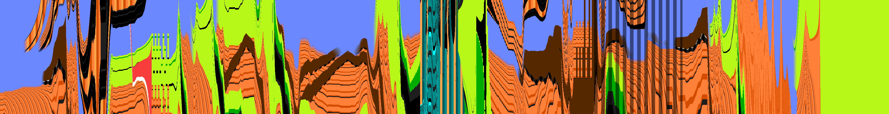

MAR1D
=====

## Beta
The game is currently in beta. Please let me know if you find any bugs so I can fix them!

## Description
The original Super Mario Bros as you've never seen it. Step into Mario's shoes in this first person clone of the classic Mario game. True to the original, however, the game still takes place in a two dimensional world. You must view the world as mario does, as a one dimensional line.

## Inspiration / Ideas
The book "Flatland" by Edwin Abbott Abbott did a really neat thing in trying to make intuitive the notion of *living* in a two dimensional world. But when we exist in a world, we *act* in that world, and the natural way to bring an unfamiliar space to our intuitions is with an active roll. To this end, I've created MAR1D, a video game that is played in two dimensional space, so we can not only understand, but *feel* what two dimensions is.

I have plans to make similar games that explore other geometries in the same way; though these games will probably not be done for a while.

Other notable similar exploits include:

* [Flatland](https://en.wikipedia.org/wiki/Flatland)
* [magictile](http://roice3.org/magictile/)
* [A Slower Speed of Light](http://gamelab.mit.edu/games/a-slower-speed-of-light/)
* [Antichamber](http://www.antichamber-game.com/)
* [Hyperrogue](http://www.roguetemple.com/z/hyper/)
* [4D Toys](http://www.4dtoys.com/) (Though I've never personally played it)
* Send me any I'm missing! I love playing with these things :)

## Playing the Game
I'll be trying to put out binaries in the near future, but for now you'll have to compile it yourself, and then run the `./MAR1D` executable in the main directory, or `./install/bin/MAR1D` (or wherever you've installed it) with optional command line arguments as described below.

The `./install/bin/MAR1D` executable takes a few command line arguments (note that all numerical arguments must be integers):
* `-m` mutes the audio
* `-f` unmutes the sound effects if the audio is muted, so it does nothing on its own, but `-mf` will enable only sound effects.
* `-w##` sets the display area to a width of `##` pixels.
* `-s##` sets the mouse sensitivity.
* `-r` reverses the mouse y axis. Not sure why this is necessary, but lots of games seem to include it.

## Compiling
### Dependencies
* Cmake
* Doxygen
* libao

### Linux
It should be enough to just run ./compile.sh from the main source directory if you have all the dependencies.
If you would like to install it under a certain prefix, you can modify ./compile.sh to change `-DCMAKE_INSTALL_PREFIX=../install` to point to wherever you would like to install it

***NOTE:*** If you use nix(os), there's a nix package for MAR1D under 'mar1d'. If you don't use nix(os), you should!

### Mac OS X
* Homebrew

If you're using homebrew, run 

`brew install cmake doxygen libao` 

to install the dependencies, then run 

`C_INCLUDE_PATH=/usr/local/Cellar/libao/1.2.2/include/ ./compile.sh`

from the main source directory. It appears homebrew puts libao in a weird place.

* Nix

I'll hopefully be able to make and test a nix package for MAR1D on mac soon, so look forward to that : )

* Macports

I haven't tested this with macports. If someone wants to do that and tell me if there are any hiccups, that would be great. The only problem should be locating where macports puts libao and setting `C_INCLUD_PATH` to that before running `./compile.sh`.

## License
Licensed under AGPL v3.0, check COPYING for more details

## Extras

Below is a screencap of me playing through the first stage, as well as an image depicting the same video, with time on the x-axis.

## Credits
* Edwin Abbott Abbott
  * Writing Flatland and inspiring this game
* [Maurice Guégan](http://stabyourself.net/about/)
  * Making [Mari0](http://stabyourself.net/mari0/), and inspiring me to hack on Mario
  * The audio files in MAR1D are from Mari0
  * Helping me out with the game logic for spawning enemies
  * Being an awesome guy
* Owen Lynch
  * Hosting the game on his github
  * Helping out with some of the coding (Especially setting up cmake. I hate compiling C code)
  * Being a great friend
* Friends and Family
  * Testing
  * Moral Support
  * Putting up with me getting sucked into coding for long stretches
* Yavni
  * Photoshoping the menuscreen image
  * Coming up with the title "MAR1D"
* Nintendo
  * Making Super Mario Bros
  * Inspiring game makers
* My parents
  * Moral support
  * Raising me
  * Inspiring me
  * Shaping me into an inquisitive person
